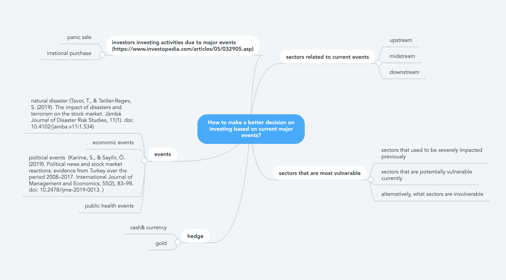

# Thesis 
## Literature Review
1. Schumaker, Robert P., Osama K. Solieman, and Hsinchun Chen. Sports Data Mining. New York: Springer, 2010.

2. Green, Fiona. Winning with Data: CRM and Analytics for the Business of Sports. Abingdon, Oxon: Routledge, 2019.

3. Kissell, Robert, and James Poserina. Optimal Sports Math, Statistics, and Fantasy. San Diego: Elsevier Science & Technology, 2017.

4. Severini, Thomas A. Analytic Methods in Sports: Using Mathematics and Statistics to Understand Data from Baseball, Football, Basketball, and Other Sports. Boca Raton, FL: CRC Press, 2020.

## Research Questions
How to make a better decision on investing based on current major events?

- sectors related to current events
    - upstream
    - midstream
    - downstream
- sectors that are most vulnerable
    - sectors that used to be severely impacted previously
    - sectors that are potentially vulnerable currently
    - alternatively, what sectors are invulnerable
- hedge
    - cash& currency
    - gold
- events
    - natural disaster (Tavor, T., & Teitler-Regev, S. (2019). The impact of disasters and terrorism on the stock market. Jàmbá Journal of Disaster Risk Studies, 11(1). doi: 10.4102/jamba.v11i1.534)
    - economic events
    - political events  (Karime, S., & Sayilir, Ö. (2019). Political news and stock market reactions: evidence from Turkey over the period 2008–2017. International Journal of Management and Economics, 55(2), 83–98. doi: 10.2478/ijme-2019-0013. )
    - public health events
- investors investing activities due to major events (https://www.investopedia.com/articles/05/032905.asp)
    - panic sale
    - irrational purchase
### Floating Topics
- I'm visualizing Big Data Used in Competitive Sports because I want to show the significance of potential advantages of software technology on enhancing athlete's performance in order to attract more innovators to investigate this field.
    - Improvement by using big data
    - strategy Analysis
    - Evidence of how big data applied in sports
- I am visualizing how the stock markets changes due to current hot events because I want to show the significance of how social events impact the stock market in order to help investors to have a better understanding on the current stock market and make better decision on investing.
    - events that influence stock market
    - technology used in trading
    - how technology helps people have a better understanding on stock market
    - tutorial for beginners
    - current hot words
- I am visualizing the spreading of virus/disease because I want to show the significance of understanding virus/disease in order to prevent ourselves from getting infected.
    - how does it spread
    - how to fight it
    - symptoms
    - history of some most severe diseases
- I am visualizing different types of food allergy because I want to show the significance of potential threaten behind food allergy in order to help people know what to do if getting allergic.
    - symptom
    - genetic/ non-genetic influence
    - population
- I am visualizing factors caused mental health because I want to show the significance of understanding mental health in order to know what to do if you realize you might have mental health issue.
    - depression
    - distribution among various population
    - history
    - social acceptance
    - therapy and other treatment
- I am visualizing facts about rock climbing in order to show the significance how rock climbing helps muscle building and core stability in order to attract more to be involved in this sports.
    - which part of the body is the most vulnerable
    - popularity
    - safety/ protection strategy
    - history
